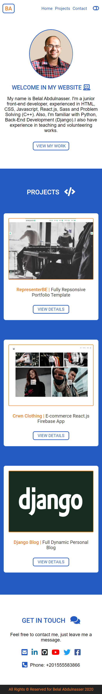

# Personal Portfolio Mobile First Fully Responsive Website
#### Description
- Mobile first fully responsive website with css grid and media queries
#### Techs used in this template:
- HTML5
- CSS Grid system
- SASS
- JQUERY
- Google Fonts
- npm
### License?
- MIT open source project
#### How to use this template?
- Git clone or download this website
- HTML files in main folder, and all remains files [CSS, JS, images] inside "static" folder
#### How to run and watch sass files?
- Open your terminal or cmd and run this command after installing  "node.js"
` npm install --save sass`
- To run and watch sass files run this command
` sass --watch ./path/to/scss/file ./path/to/css/file`
#### Screenshot
	
